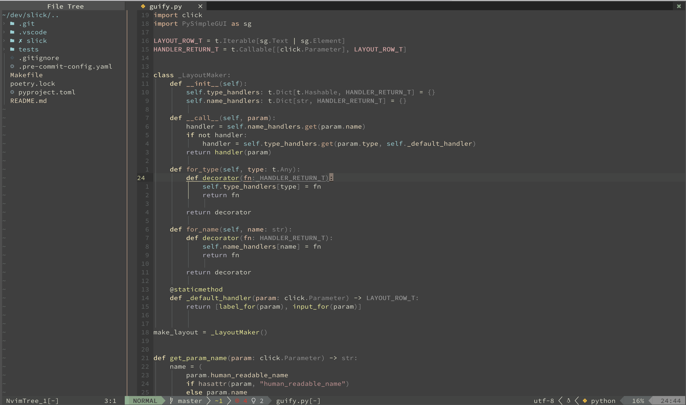

Zenburn
=======

A port of the venerable [Zenburn](https://github.com/jnurmine/Zenburn)
colorscheme to lua.

Zenburn is a low-contrast color scheme for Vim. It’s easy for your eyes and
designed to keep you in the zone for long programming sessions.

The aim of this port is to bring Zenburn into the modern age, with support for
[Treesitter](https://github.com/nvim-treesitter/nvim-treesitter) and many
more plugins.



Installation
------------

Using your favorite package manager:

[vim-plug](https://github.com/junegunn/vim-plug)

```vim
Plug "phha/zenburn.nvim"
```

[packer](https://github.com/wbthomason/packer.nvim)

```lua
use {
    "phha/zenburn.nvim",
    config = function() require("zenburn").setup() end
}
```

[paq](https://github.com/savq/paq-nvim)

```lua
require("paq") {
    "phha/zenburn.nvim";
}
```

Setup
-----

With VimScript:

```vim
colorscheme zenburn
```

With lua:

```lua
require("zenburn").setup()
```

To set the theme in lualine:

```lua
require("lualine").setup {
    options = {
        theme = "zenburn",
    }
}
```

Plugin Support
--------------

Zenburn features custom highlighting for these plugins:

* [nvim-treesitter](https://github.com/nvim-treesitter/nvim-treesitter)
* [lualine](https://github.com/nvim-lualine/lualine.nvim)
* [indent-blankline](https://github.com/lukas-reineke/indent-blankline.nvim)
* [nvim-cmp](https://github.com/hrsh7th/nvim-cmp)
* [nvim-tree](https://github.com/kyazdani42/nvim-tree.lua)
* [symbols-outline](https://github.com/simrat39/symbols-outline.nvim)
* [trouble](https://github.com/folke/trouble.nvim)
* [which-key](https://github.com/folke/which-key.nvim)
* [leap](https://github.com/ggandor/leap.nvim)
* [gitsigns](https://github.com/lewis6991/gitsigns.nvim)
* [hydra](https://github.com/anuvyklack/hydra.nvim)
* [neotest](https://github.com/nvim-neotest/neotest)

Status
------

Zenburn is in *Alpha* status. The core colors are basically a straight port
from the original Zenburn theme for vim, so there shouldn't be major issues.
However, the plugin schemes are not widely tested yet and subject to changes.

Contributing
------------

Pull requests are always welcome, especially for additional plugins. Please
include one or more screenshots showcasing your contribution.

Zenburn already has a rather large palette. I'm trying to avoid color bloat,
so please don't add any new colors if at all possible and refer to existing
ones instead.

No
--
* dayglo vomit
* black, red, blue and green on screaming white background
* headache
* watery, squinting eyes
* the "I wanna run away" feeling

Yes
---
* alien fruit salad
* harmonious colors help with concentration
* improved focus
